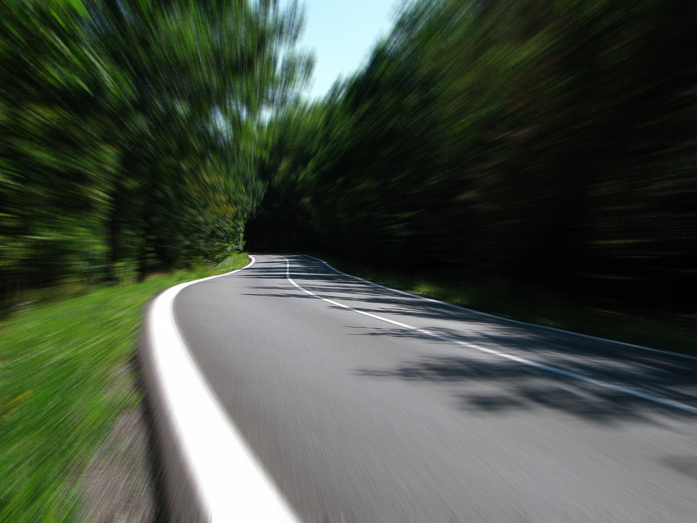
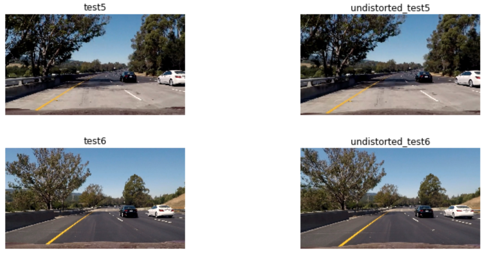
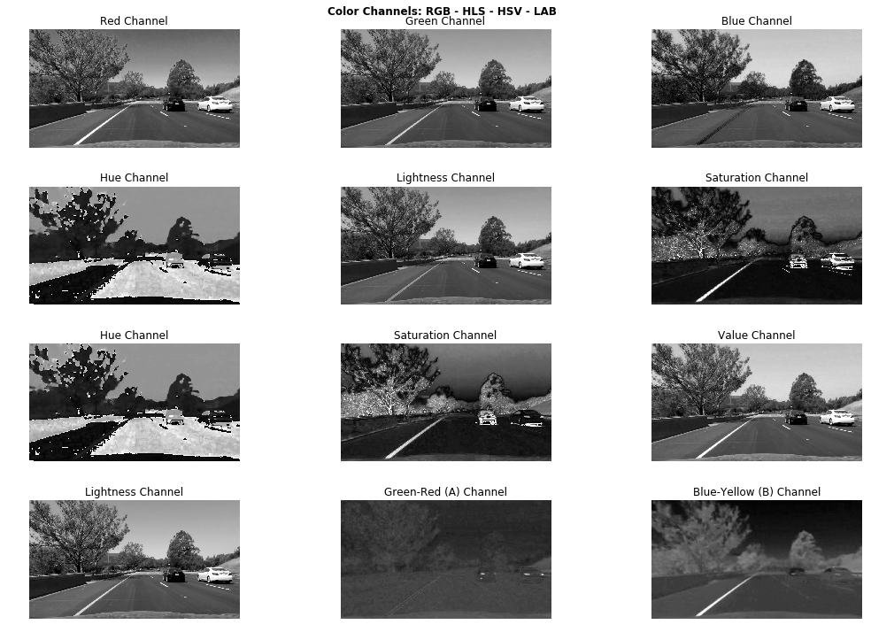
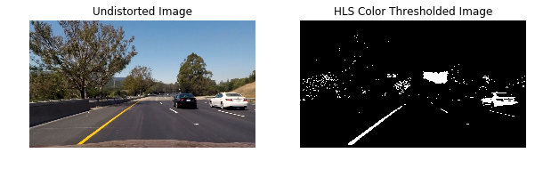
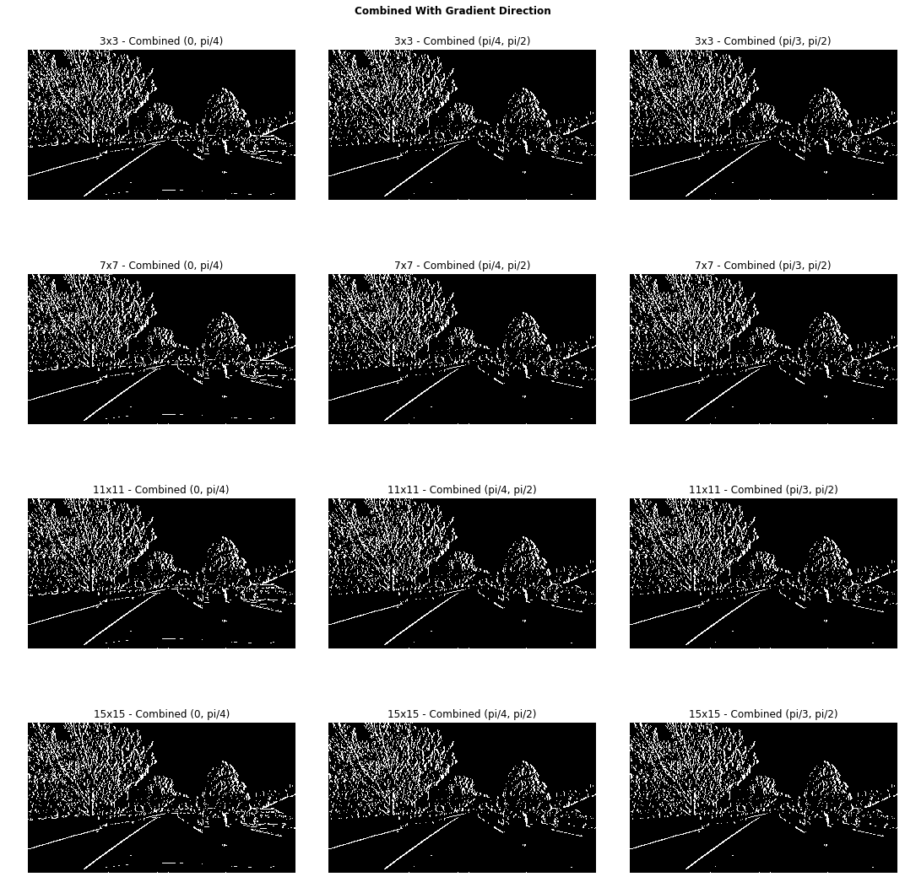
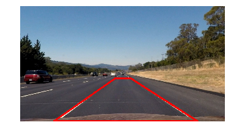
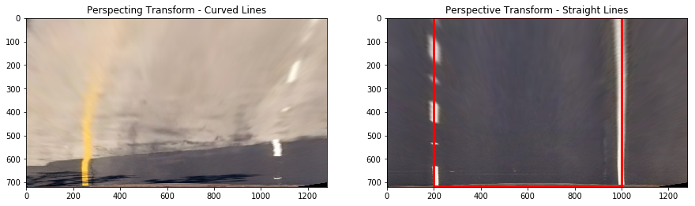
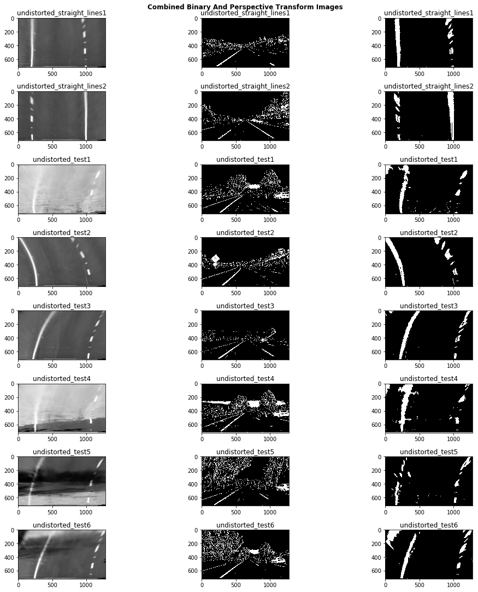
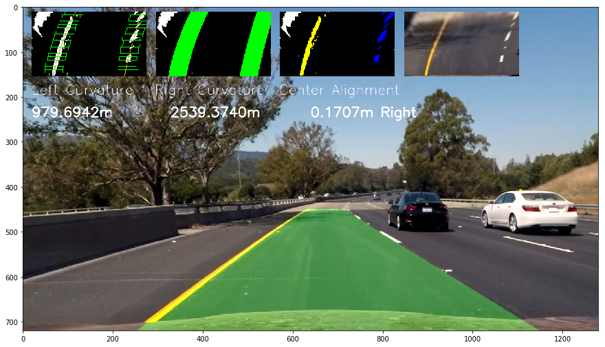

# Advanced Lane Finding



Identifying lanes on the road is a common task performed by all human drivers to ensure their vehicles are within lane constraints when driving, so as to make sure traffic is smooth and minimize chances of collisions with other cars in nearby lanes.
Similarly, it is a critical task for an autonomous vehicle to perform. It turns out that recognising lane markings on roads is possible using well known computer vision techniques. We will cover how to use various techniques to identify and draw the inside road lanes, lane curvature, and even estimate the vehicle position relative to the lane.

To detect and draw a polygon that takes the shape of the lane the car is currently in, we build a pipeline consisting of the following steps:
* Computation of camera calibration matrix and distortion coefficients from a set of chessboard images
* Undistortion of images
* Application of color and gradient thresholds to focus on lane lines
* Production of a _bird's eye view_ image via perspective transform
* Use of sliding windows to find _hot_ lane line pixels 
* Fitting of second degree polynomials to trace left and right lines composing the lane
* Computation of lane curvature and deviation from lane center
* Warping and drawing of lane boundaries on image as well as lane curvature information

This is project 4 of Term 1 of the Udacity Self Driving Car Engineer Nanodegree.

# Camera Calibration & Image Undistortion

The first step we will take is to find the calibration matrix, along with distortion coefficient for the camera that was used to take pictures of the road. This is necessary because the convex shape of camera lenses curves light rays as the enter the pinhole, therefore causing distortions to the real image. Therefore lines that are straight in the real world may not be anymore on our photos. 

To compute the camera the transformation matrix and distortion coefficients, we use a multiple pictures of a _chessboard_ on a flat surface taken **by the same camera**. OpenCV has a convenient method called [findChessboardCorners](http://docs.opencv.org/2.4/modules/calib3d/doc/camera_calibration_and_3d_reconstruction.html#cv2.findChessboardCorners) that will identify the points where black and white squares intersect and reverse engineer the distorsion matrix this way. The image below shows the identified chessboard corners traced on a sample image

 

We can see that corners are very well identified. Next we run our chessboard finding algorithm over multiple chessboard images taken from different angles to identify image and object points to calibrate the camera. The former refers to coordinates in our 2D mapping while the latter represents the real-world coordinates of those image points in 3D space (with z axis, or depth = 0 for our chessboard images). Those mappings enable us to find out how to properly undistort an image taken from the same camera. You can witness it's effectiveness on the image below:


We are now in a position to undistort all images, as shown below:



# Thresholding

We apply color and edge  thresholding in this section to better detect the lines, and make it easier to find the polynomial that best describes our left and right lanes later. 

We start with first exploring which color spaces we should adopt to increase our chances of detecting the lanes and facilitating the task of the gradient thresholding step.

## Color Thresholding

We experiment with different color spaces to see which color space and channel(s) we should use for the most effective separation of lane lines:



On the RGB components, we see that the blue channel is worst at identifying yellow lines, while the red channel seems to give best results.

For HLS and HSV, the hue channel produces an extremely noisy output, while the saturation channel of HLS seems to give the strong results; better than HSV's saturation channel. conversely, HSV's value channel is giving a very clear grayscale-ish image, especially on the yellow line, much better than HLS' lightness channel.

Lastly, LAB's A channel is not doing a great job, while it's B channel is strong at identifying the yellow line. But it is the lightness channel that shines (no pun intended) at identify both yellow and white lines.

At this stage, we are faced with various choices that have pros and cons. Our goal here is to find the right thresholds on a given color channel to highlight yellow and white lines of the lane. There are actually many ways we could achieve this result, but **we choose to use HLS because we already know how to set thresholds for yellow and white lane lines from [Project 1: Simple Lane Detection](https://github.com/kenshiro-o/CarND-LaneLines-P1)** .


The code below shows how we threshold for white and yellow (our lane colors) on HLS and produce a binary image:

```
def compute_hls_white_yellow_binary(rgb_img):
    """
    Returns a binary thresholded image produced retaining only white and yellow elements on the picture
    The provided image should be in RGB format
    """
    hls_img = to_hls(rgb_img)
    
    # Compute a binary thresholded image where yellow is isolated from HLS components
    img_hls_yellow_bin = np.zeros_like(hls_img[:,:,0])
    img_hls_yellow_bin[((hls_img[:,:,0] >= 15) & (hls_img[:,:,0] <= 35))
                 & ((hls_img[:,:,1] >= 30) & (hls_img[:,:,1] <= 204))
                 & ((hls_img[:,:,2] >= 115) & (hls_img[:,:,2] <= 255))                
                ] = 1
    
    # Compute a binary thresholded image where white is isolated from HLS components
    img_hls_white_bin = np.zeros_like(hls_img[:,:,0])
    img_hls_white_bin[((hls_img[:,:,0] >= 0) & (hls_img[:,:,0] <= 255))
                 & ((hls_img[:,:,1] >= 200) & (hls_img[:,:,1] <= 255))
                 & ((hls_img[:,:,2] >= 0) & (hls_img[:,:,2] <= 255))                
                ] = 1
    
    # Now combine both
    img_hls_white_yellow_bin = np.zeros_like(hls_img[:,:,0])
    img_hls_white_yellow_bin[(img_hls_yellow_bin == 1) | (img_hls_white_bin == 1)] = 1

    return img_hls_white_yellow_bin
```

The result can be seen just below:




As you can see above, our HLS color thresholding achieve great results on the image. The thresholding somewhat struggles a little with the shadow of the tree on the yellow line further up ahead. We believe gradient thresholding can help in this case.

## Gradient Thresholding

We use the [Sobel](https://en.wikipedia.org/wiki/Sobel_operator) operator to identify _gradients_, that is change in _color intensity_ in the image. Higher values would denote strong gradients, and therefore sharp changes in color.

We have decided to use LAB's L channel as our single-channel image to serve as input to the sobel functions below.

We experimented with many parameters and across different Sobel operations (all available for you to see on this Jupyter [notebook](https://github.com/kenshiro-o/CarND-Advanced-Lane-Lines/blob/master/notebook.ipynb)), and came up with this final result:



## Combining both

We naturally combine both color and Sobel thresholded binary images, and arrive at the following results:

 

On the left image, all green pixels were retained by our Sobel thresholding, while the blue pixels were identified by our HLS color thresholding.
The results are very encouraging and it seems we have found the right parameters to detect lanes in a robust manner. We turn next to applying a perspective transform to our image and produce a _bird's eye view_ of the lane.

# Perspective Transform

We now need to define a trapezoidal region in the 2D image that will go through a perspective transform to convert into a bird's eye view, like in the below:



We then define 4 extra points which form a rectangle that will map to the pixels in our source trapezoid:

```
dst_pts = np.array([[200, bottom_px], [200, 0], [1000, 0], [1000, bottom_px]], np.float32)
```

The perspective transform produces the following type of images:



# Putting It All Together

We can see that our perspective transform keeps straight lines straight, which is a required sanity check. The curved lines however are not perfect on the example above, but they should not cause unsurmountable problems for our algorithm either. 

We can now apply our thresholding to our bird's eye view images:




## Histogram

We then compute a histogram of our binary thresholded images in the y direction, on the bottom half of the image, to identify the x positions where the pixel intensities are highest:


## Finding Lines And Drawing The Lane Area

### Sliding Windows 

Since we now know the starting x position of pixels most likely to yield a lane line, we run a [sliding windows search](https://www.coursera.org/learn/machine-learning/lecture/bQhq3/sliding-windows) in an attempt to "capture" the pixel coordinates of our lane lines. 

From then, it is we simply compute a second degree polynomial, via numpy's [polyfit](https://docs.scipy.org/doc/numpy-1.13.0/reference/generated/numpy.polyfit.html), to find the coefficients of the curves that best fit the left and right lane lines. 

One way we improve the algorithm is by saving the previously computed coefficients for frame _t-1_ and attempt to find our lane pixels from those coefficients. However, when we do not find enough lane line pixels (less than 85% of total non zero pixels), we revert to sliding windows search to help improve our chances of fitting better curves around our lane.

### Lane Curvature

We also compute the lane curvature by calculating the radius of the smallest circle that could be a tangent to our lane lines - on a straight lane the radius would be quite big. We have to convert from pixel space to meters (aka real world units) by defining the appropriate pixel height to lane length and pixel width to lane width ratios:

```
# Height ratio: 32 meters / 720 px
self.ym_per_px = self.real_world_lane_size_meters[0] / self.img_dimensions[0]

# Width ratio: 3.7 meters / 800 px
self.xm_per_px = self.real_world_lane_size_meters[1] / self.lane_width_px

``` 

I tried to manually estimate the length of the road on my bird's eye view images by referring to data from this [resource](https://www.psychologicalscience.org/news/motr/lines-on-the-road-are-longer-than-you-think.html): every time a car has travelled it has passed 40 feet (around 12.2 meters).

Moreover, you can find more information on the mathematical underpinnings of radius of curvature via the following [link](https://www.intmath.com/applications-differentiation/8-radius-curvature.php). 

We also compute the car's distance from the center of the lane by offsetting the average of the starting (i.e. bottom) coordinates for the left and right lines of the lane, subtract the middle point as an offset and multiply by the lane's pixel to real world width ratio.

### Unwarping Drawing Lane Area 

Finally, we draw the inside the of the lane in green and _unwarp_ the image, thus moving from bird's eye view to the original image. Additionally, we overlay this big image with small images of our lane detection algorithm to give a better feel of what is going on _frame by frame_. We also add textual information about lane curvature and vehicle's center position:




#### Final Results

The following gif shows we have built a strong lane detection pipeline for the project video:


A video was also created and available on [github](https://github.com/kenshiro-o/CarND-Advanced-Lane-Lines/blob/master/output_videos/lanes_project_video.mp4). It will soon also be made available on Youtube.

# Conclusion

This was an exciting, but hard project, which felt very different from our previous 2 deep learning projects. We've covered how to perform camera calibration, color and gradient thresholds, as well as perspective transform and sliding windows to identify lane lines! The sliding windows code was particularly hard to understand initially but after long time debugging it and making comments (all available on my notebook) I finally understood every line! 

We believe there are many improvements that could be made to this project, such as:
* experiment with LAB color space to determine whether we can produce better color thresholding
* use convolutions instead of sliding windows
* produce an exponential moving average of the line coefficients of previous frames and use it when our pixel detection fails
* better detect anomalies in pixels "captured" (e.g. some non-zero pixels that are completely off the line) and reject them
* apply other relevant computer vision techniques not covered by this project

Moreover, we need to build a much more robust pipeline to succeed on the two challenge videos that are part of this project.  

As usual, I'd like to thank my mentor Dylan for his advice and support as well as my peers at Udacity, previous and present cohort, for putting together great writeups and inspiring me. 
